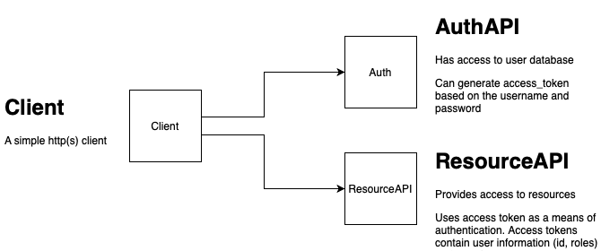

A simple project showcasing the authentication flow in order to access 
resource api.

In order for client to access resource api it first needs to retrieve an 
access token from auth service. Auth validates username and password and 
returns an access token if the user data is valid.

After that client uses this token to access resources at Resource API.




Run

Application can be run in docker

```
docker-compose up
```