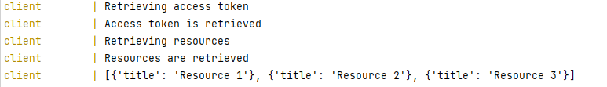
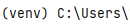
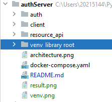

A simple project showcasing the authentication flow in order to access 
resource api.

In order for client to access resource api it first needs to retrieve an 
access token from auth service. Auth validates username and password and 
returns an access token if the user data is valid.

After that client uses this token to access resources at Resource API.


Run

Application can be executed in docker. There will be three containers running: 
auth, resource_api, and client.

auth and resource_api are FastAPI apps and client is just a simple script that
gets and access token and retrieves resources from resource_api.

```
docker-compose up
```

You can access swagger of auth and resource_api

auth at http://localhost:8001/docs

resource_api at http://localhost:8002/docs


After successful execution of client you should see the following output


Virtual environment screenshots



